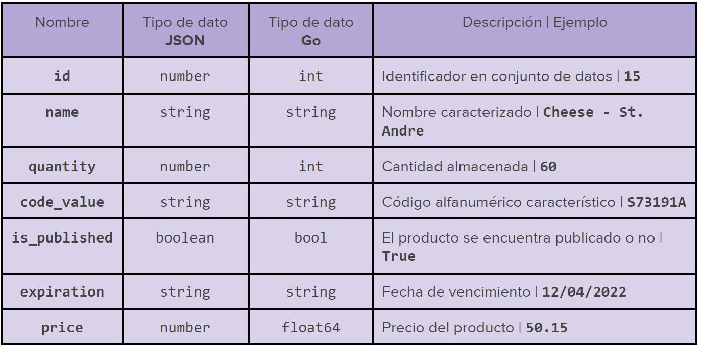

# Problema

Un supermercado necesita un sistema para gestionar los productos frescos que tienen
publicados en su página web. Para poder hacer esto, necesitan un servidor que ejecute
una API que les permita manipular los productos cargados desde distintos clientes. Los
campos que conforman un producto son:

## Ejercicio: Precio consumidor
Los precios de los productos de nuestro sistema están guardados con el precio del proveedor. Vamos a añadir un nuevo endpoint a nuestro servicio:

**GET /products/consumer_price?list=[id, id, … ]**

Este nos devuelve el precio de la **suma de uno o más productos** identificados por sus respectivos ID, aplicando un **impuesto/arancel**. Esta consulta tiene las siguientes restricciones:

- Si se solicitan más cantidades del mismo producto, se repite el ID de este en la lista.

- La cantidad solicitada no debe superar la cantidad en stock.

- Si la **compra es de menos de 10 productos**, se aplica un impuesto/arancel del **21%** sobre el precio total. Esto se obtiene con la siguiente fórmula:    
*𝑃𝑡𝑎𝑥𝑒𝑠 = 𝑃 * 1. 21*

- Si la **compra es de más de 10 productos hasta 20**, se aplica un impuesto/arancel del **17%** sobre el precio total. Esto se obtiene con la siguiente fórmula:  
*𝑃𝑡𝑎𝑥𝑒𝑠 = 𝑃 * 1. 17*

- Si la **compra es de más de 20 productos** se aplica un impuesto/arancel del **15%** sobre el precio total. Esto se obtiene con la siguiente fórmula: 
*𝑃𝑡𝑎𝑥𝑒𝑠 = 𝑃 * 1. 15*

Por último, retornamos un objeto con dos campos: el producto **products** del tipo list con la lista de productos del tipo object y **total_price** del tipo number con el precio con impuestos.
Ejemplo

